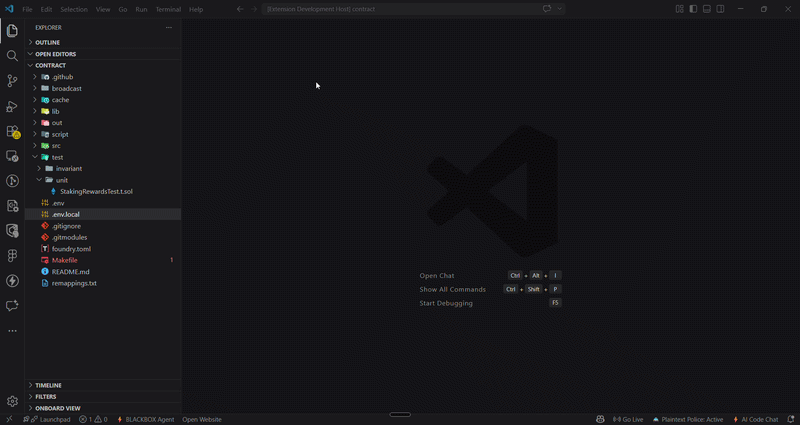

# Plaintext Police 🚔

> Don't put your private key in plain text.

Plaintext Police is a VS Code extension that watches your files in real time and alerts you the moment a private key, mnemonic, or secret is exposed in plain text — before you accidentally push it to git.

Inspired by a public challenge from [Patrick Collins](https://x.com/PatrickAlphaC), one of the most prominent Web3 educators in the space.

---

## Features

- **Real-time detection** — scans every file as you type, the moment a key is detected you are alerted immediately
- **Red squiggly underlines** — highlights the exact line where the key is exposed, just like a TypeScript compiler error
- **Problems panel** — every exposed key across your workspace appears in the VS Code Problems panel with the file name and line number
- **Workspace-wide scan** — scans all high-risk files on startup so nothing slips through from files you haven't opened yet
- **`.gitignore` checker** — warns you if your `.env` file is not listed in `.gitignore`
- **Terminal warning** — reminds you on startup to avoid passing raw private keys into CLI commands like `forge` and `cast`
- **Status bar indicator** — a permanent `🚔 Plaintext Police: Active` badge confirms the extension is running
- **Optional siren alert** — play an audio alert when a key is detected (disabled by default, enable in settings)
- **Cross-platform** — works on Windows, macOS, and Linux

---

## What It Detects

| Pattern | Example |
|---|---|
| `.env` private key with `0x` prefix | `PRIVATE_KEY=0xac0974bec39a17e36ba4a6b4d238ff944bacb478...` |
| `.env` private key without prefix | `PRIVATE_KEY=ac0974bec39a17e36ba4a6b4d238ff944bacb478...` |
| Hardcoded in code | `const privateKey = "0xac0974bec..."` |
| Forge/Cast CLI flag | `--private-key 0xac0974bec...` |
| Mnemonic seed phrase | `MNEMONIC=word1 word2 word3 ... word12` |

---

## Files Scanned

Plaintext Police only scans files where private keys realistically appear:

```
.env
.env.local
.env.development
.env.*
*.sol
Makefile
*.sh
```

The following are explicitly excluded to avoid noise and false positives:

```
node_modules/
broadcast/
cache/
out/
lib/
dist/
build/
prisma/
generated/
.git/
```

---

## Installation

Search for **Plaintext Police** in the VS Code Extensions Marketplace and click Install.

Or install via the command line:

```bash
code --install-extension plaintext-police
```

---

## Usage

The extension activates automatically when VS Code opens. No configuration required.

Once active you will see:

- `🚔 Plaintext Police: Active` in the bottom right status bar
- Red squiggly underlines on any line with an exposed key
- A popup alert demanding acknowledgment when a key is detected
- All detections listed in the **Problems** panel (`Ctrl+Shift+M`)

### Enable Audio Alert

By default the siren is disabled. To enable it:

1. Open VS Code Settings (`Ctrl+,`)
2. Search for `Plaintext Police`
3. Toggle **Enable Sound** to `true`

Or add this to your `settings.json`:

```json
{
  "plaintextPolice.enableSound": true
}
```

---

## The Right Way to Handle Private Keys

> [!WARNING]
> Never store a real private key in `.env`, source code, or any file that could be committed to git.

**For Foundry projects**, use an encrypted keystore:

```bash
cast wallet import mykey --interactive
```

Then reference it by name instead of exposing the raw key:

```bash
forge script script/Deploy.s.sol --account mykey --rpc-url $RPC_URL
```

**For all projects**, make sure `.env` is in your `.gitignore`:

```bash
echo ".env" >> .gitignore
```

---

## Contributing

Contributions are welcome. If you find a pattern that Plaintext Police misses or incorrectly flags, open an issue with an example and we will update the detection engine.

1. Fork the repository
2. Create a feature branch: `git checkout -b feature/your-feature`
3. Commit your changes: `git commit -m 'add: your feature'`
4. Push and open a pull request

---

## Acknowledgements

Built in response to a public challenge by [Patrick Collins](https://x.com/PatrickAlphaC) — the Web3 educator behind Cyfrin Updraft who has spent years telling developers not to put their private keys in plain text.

---

## License

MIT